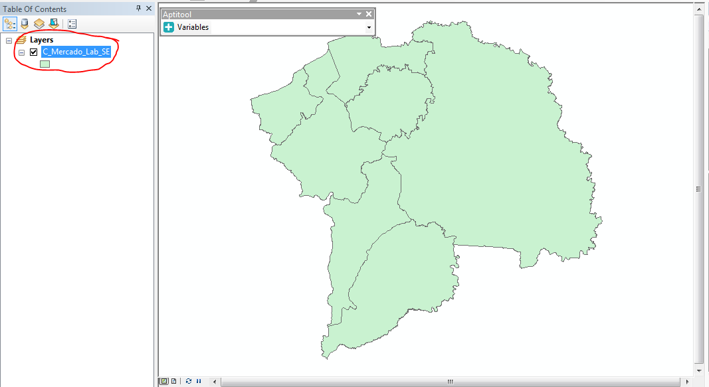

# Aptitool AddIn

Es una herramienta del tipo AddIn que se incorpora a ArcGIS para generar reporte del comportamiento de las variables según el componente que se seleccione. Esta herramienta es un complemento al proceso de zonificación que se desarrolla en la [UPRA](http://www.upra.gov.co/) y como tal hace falta que la estructura de almacenamiento se corresponda con la que se genera en este proceso, para mayor información dirigirse al repositorio de [zonificación](https://upraanalisis.github.io/zonificacion/). 


## Instalación

El proceso de instalación es el siguiente:

1. Descargar el `AddIn`:

    Existen dos opciones de descarga, se puede descargar todo el repositorio o solo el ultimo Release del AddIn [Aquí](https://github.com/UpraAnalisis/AptiTool/releases/latest)

2. Luego hay dos opciones:

3. Si descargo el código, descomprimir y ejecutar el script `makeaddin.py`

4. Si descargo el release, descomprimir. 

5. finalmente común a ambos copiar el archivo con extensión `.esriaddin` en el directorio:

    ```directorio Arcgis
    %USERPROFILE%\Documents\ArcGIS\AddIns\
    ``` 

Ingresar a la versión de arcgis en la que se quiera instalar el AddIn y pegar el archivo.

## Uso

### Carga Capas Necesarias

1. Cargar capas del criterio que se quieren consultar.

### Selección criterio

1. Seleccionar el criterio en el TOC de ArcGIS

    

2. Seleccionar la herramienta

    

3. Dar Click en el punto de interés que se desea consultar 

    

### Selección Variables

Una vez realizado el proceso anterior el AddIn consulta en la gdb con las variables aquellas que corresponden a el criterio de interés, luego de eso carga los nombre en el menú desplegable y estan listas para ser adicionadas a la visualización del mapa. 

1. Seleccione variable a cargar en el en el menú desplegable

    

2. Mensaje advierte que la variable se está cargando, pulse OK

    

### Generación Reporte

1. Se carga la variable y mensaje Advierte si quiere generar reporte. (Reporte es Opcional)

    

2. Si decide generar reporte seleccione donde lo desea guardar.

    

3. De no generar reporte los datos quedan en un layer temporal llamado data y ahí los puede consultar. 

    
    
4. El reporte aparece en excel de la siguiente forma: 

    
